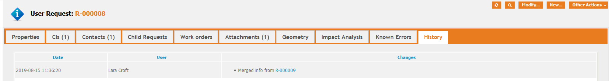

# jb-ticket-merge

First version available! (Very stable, but some advanced features are still being implemented).
If you are interested in a quick development of this extension or a specific feature, consider getting in touch.
Also you're interested in acquiring this extension now or to be informed when it's out of beta, contact **jbostoen.itop@outlook.com**

## What?
Merges any sub class of Tickets.

One Ticket is chosen as "target" Ticket. User decides which ticket will be kept as main Ticket, and which ones will be merged.

The attribute types to be merged are:
* AttributeCaseLog - merges case log entries (sorted chronologically!) + possible append/prepend
* AttributeLinkedSet - related WorkOrders, ...
* AttributeLinkedSetIndirect - related functional CIs, functional Contacts, ...

Attachments may be copied to the target Ticket.

**Options**

* specify which attributes can be merged, which ones are merged by default, which ones are always merged (forced), ...

* add callers from merged Tickets on the related contacts tab of the target Ticket. This allows Notifications to be sent to everyone linked to this Ticket.
* add description from merged Tickets as a case log entry (for example in public_log).
* delete all Tickets except for target after merge

* New triggers
  * Trigger On Ticket Merge Source Processed
    * Offers access to information about this one source Ticket (excludes target Ticket!)
    * Placeholders: current_contact_id, current_contact_friendlyname, current_date, current_time and target_object
    * Use case: inform the caller of the source Tickets that their Ticket has been merged with the target Ticket (and give that Ticket's reference)
  * Trigger On Ticket Merge Target Processed
    * Offers acces to information about the target Ticket only
    * Placeholders: current_contact_id, current_contact_friendlyname, current_date, current_time
    * Use case: notify caller and now related contacts on target Ticket that Tickets have been merged and others will now receive notifications too.

**Work in progress**

* perform actions on target object as well as merged objects, similar to Combodo's User Actions Configurator.
  * on all objects: apply stimulus (so they can be resolved/closed automatically), set attributes, append text, ...
  * place holders: $this for the actual object; $source_object for copying data from the target Ticket to the merged Ticket


## Out of scope
Ideas which will only get implemented when sponsored:
* merge Tickets into new Ticket instead of existing one
* merge different child classes of Tickets into one
* detailed history track (which log entries, linked sets, attachments, ... were merged and from which original Ticket?)

## Screenshots




## Cookbook

XML:
- something

PHP:
- how to introduce custom iTop pages
- how to add a menu item in the Other Actions menu
- how to add custom triggers (Action and EventNotification)
- use built-in iTop methods to obtain attribute list for a class
- use built-in iTop methods to display lists
- use built-in iTop methods to check user rights
- use built-in iTop methods to prevent malicious actions
- use DBObject::Fingerprint() for various tasks: to uniquely identify objects or look for very similar ones or see if attributes changed
- ...

## Settings

```
// Module settings, defaults.
$aModuleSettings = [

	'attributes' => [
		// Attributes must be one of these types: 'AttributeCaseLog', 'AttributeLinkedSet', 'AttributeLinkedSetIndirect'
		// Attributes must be specified by their attribute code. If all attributes (of the above types) are specified, it's possible to use ['*']
		
		// Attributes which can be merged for this class
		'allowed' => ['contacts_list', 'functionalcis_list', 'private_log', 'public_log'],
		
		// ['*'] can be used to include ALL attributes.
		'checked' => ['*'],
		
		// Attributes which are ALWAYS merged (enforced). Any attribute specified here should also be in the allowed list.
		'required' => ['private_log', 'public_log'],
		
	],
	
	'target_object' => [
	
		// Similar to Combodo's User Actions Configurator. Runs actions on the target Ticket.
		'actions' => [
		],
		
		'actions' => [
			'apply_stimulus' => 'some_stimulus', // Similar to Combodo's User Actions Configurator. String. Stimulus code
			'copy' => 'some_attribute_code'
		],
		
		// Add callers of the merged tickets to 'related Contacts' (those Contacts could be used in Notification)
		'add_callers_to_related_contacts' => true, 
		
		// Specify the order of Tickets in the dropdown list when determining the target Ticket.
		// Multiple attributes can be specified. Processed in order.
		'selection_order' => [
			'id' => true, // Set to 'true' for sorting target objects from oldest to newest; set to false for newest to oldest
		],
		
	],
	
	'merged_objects' => [
		// Similar to Combodo's User Actions Configurator. Runs actions on the Tickets that were merged, except Target ticket.
		'actions' => [
			'apply_stimulus(some_stimulus)',
			'set(attribute_name,some_value)',
			'set(attribute_name,$source_object->title$)', // $source_object->attribute_name$ is generic; it reads data from the Target ticket (which is the $source_object here)
		],
		'delete' => true, // Delete objects after merging
	],
	
	// CSV list of profiles which may merge Tickets.
	// The user must have at least one profile to have the shortcut available. 
	// Incorrect profiles names are ignored. Set as an asterix to allow for everyone.
	'allowed_profiles' => '*', 
		
	
]; 

```

## Translations
* French translation by Guillaume Lajarige (@Molkobain)

## License
https://www.gnu.org/licenses/gpl-3.0.en.html
Copyright (C) 2019 Jeffrey Bostoen
